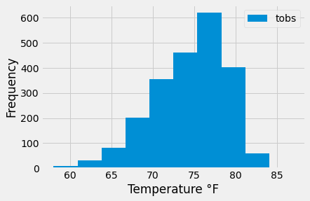
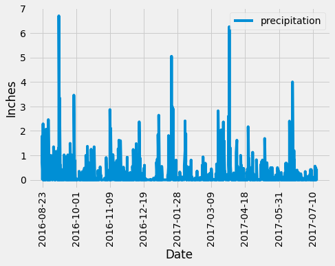

<h1 align="center">SQLAlchemy Homework - Surfs Up!</h1>

<h3 align="center">You've decided to treat yourself to a long holiday vacation in Honolulu, Hawaii! To help with your trip planning, you need to do some climate analysis on the area.</h3>
							
### Contents:

        /resources - sqlite, csv, png files

        app.py - flask app for queries in json format
        climate_starter.ipynb - climate queries in sqlalchemy/pandas
        temp_analysis_bonus_1_starter.ipynb - specific month temp. analyis
        temp_analysis_bonus_2_starter.ipynb - historical data analysis for a specific week

  <h2>Plots</h2>
  

    
  

  

    
  

			
        

### Analysis:
	
        1. Precipitation Analysis

        2. Station Analysis

        3. Temperature Analysis

        4. Daily Rainfall Average

        5. Daily Temperature Normals